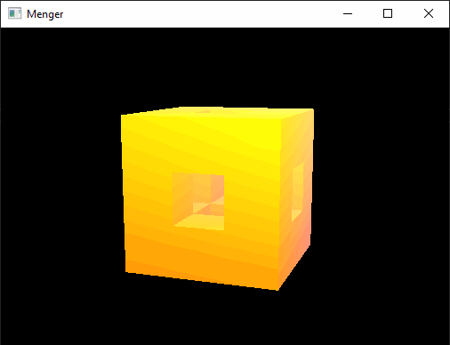

# Computer Graphics (CPSC 453): Menger Spong Fractal Project 
Jackson Cougar Wiebe &bull; University of Calgary &bull; Fall 2019

## Menger

Menger uses opengl to render the [menger sponge fractal](https://en.wikipedia.org/wiki/Menger_sponge).

This demo allows you to change the depth of fractal recursion, control the viewport camera, and change the perspective between orthographic and perspective.

## Demo (wait for it)

# Compile

Compile with CMake

# Controls

- `F7`    Toggle between Orthographic and Perspective projection.
- `F8`    Toggle between lighting and flat shading.
- `-`     Reduce Menger fractal iterations.
- `*`     Increase Menger fractal iterations.

- `Esc`   Exit mouse rotation mode

- Rotation: Click on the viewport to enter mouse rotation mode. Rotate using mouse x and y movements.
- Zoom: Zoom out by holding \<ctrl\> and moving the mouse up and down (y coordinate).

## Dependancies

- glew (external)
- glfw3 (external)